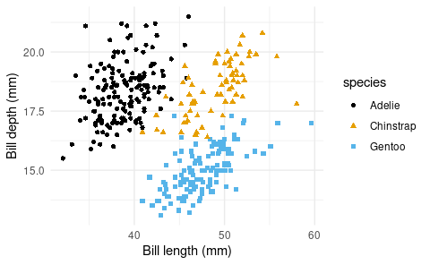

= Hello, Penguins!
Andrew

== Data

For this analysis we’ll use the penguins dataset from the palmerpenguins R package.

[source,r,cell-code]
----
library(tidyverse)
library(ggthemes)
library(palmerpenguins)
library(gt)

penguins
----

....
# A tibble: 344 × 8
   species island    bill_length_mm bill_depth_mm flipper_length_mm body_mass_g
   <fct>   <fct>              <dbl>         <dbl>             <int>       <int>
 1 Adelie  Torgersen           39.1          18.7               181        3750
 2 Adelie  Torgersen           39.5          17.4               186        3800
 3 Adelie  Torgersen           40.3          18                 195        3250
 4 Adelie  Torgersen           NA            NA                  NA          NA
 5 Adelie  Torgersen           36.7          19.3               193        3450
 6 Adelie  Torgersen           39.3          20.6               190        3650
 7 Adelie  Torgersen           38.9          17.8               181        3625
 8 Adelie  Torgersen           39.2          19.6               195        4675
 9 Adelie  Torgersen           34.1          18.1               193        3475
10 Adelie  Torgersen           42            20.2               190        4250
# ℹ 334 more rows
# ℹ 2 more variables: sex <fct>, year <int>
....

== Species

The figure below is a scatterplot of species of penguins.

[source,r,cell-code]
----
ggplot(data = penguins,
       mapping = aes(x = bill_length_mm, 
                     y = bill_depth_mm,
                     color = species,
                     shape = species)) +
  geom_point() +
  scale_color_colorblind() +
  labs(x = "Bill length (mm)", y = "Bill depth (mm)") +
  theme_minimal()
----

== Penguins

The table below shows the first 10 penguins from the dataset.

[source,r,cell-code]
----
penguins |>
  slice_head(n = 10) |>
  select(species, island, bill_length_mm, bill_depth_mm) |>
  gt()
----

[cols=",,,",options="header",]
|===
|species |island |bill_length_mm |bill_depth_mm
|Adelie |Torgersen |39.1 |18.7
|Adelie |Torgersen |39.5 |17.4
|Adelie |Torgersen |40.3 |18.0
|Adelie |Torgersen |NA |NA
|Adelie |Torgersen |36.7 |19.3
|Adelie |Torgersen |39.3 |20.6
|Adelie |Torgersen |38.9 |17.8
|Adelie |Torgersen |39.2 |19.6
|Adelie |Torgersen |34.1 |18.1
|Adelie |Torgersen |42.0 |20.2
|===
